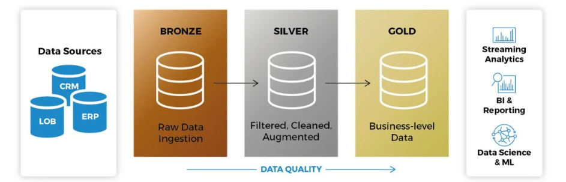
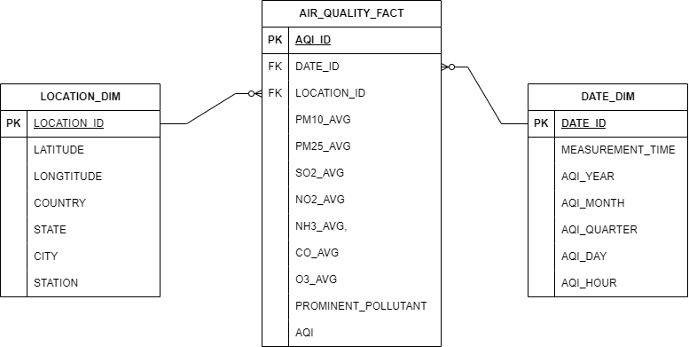
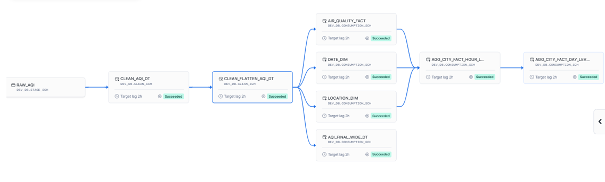

# A Data Warehousing Solution for Air Quality Trends


## Background
Assuming, A city’s environmental agency wants to provide residents with an **Interactive dashboard** that displays real-time and historical **Air Quality Index (AQI)** trends. The data will help citizens make informed decisions about outdoor activities, especially in areas prone to high pollution levels.

## Objective
Build a `data solution` that fetches AQI data from a public API, clean and transform, and load it into a database or warehouse that serves as the source for reporting (dashboard).

## Prerequisites
  - Snowfalke Account (Free Edition is enough)
  - Account on `data.gov.in` for source data
  - Github Account for `CICD`
  - Text Editor (VS Code) - Optional
  - JSON Visualiser - Optional

## Environmet Setup
- Create `DEV_DB` databse
- Create 3 schemas for each layer
    - `BRONZE_SCM:` For Staging Layer
    - `SILVER_SCM:` For Clean Layer
    - `GOLD_SCM:` For Consumption Layer
- Create `Compute Resources` accordingly


## Medallion Architecture Overview

The Medallion Architecture organizes data pipelines into **Bronze**, **Silver**, and **Gold** layers, ensuring scalability and data quality.

**1. Bronze Layer**
   - Stores raw, unprocessed data as ingested from the source.
   - Acts as source of truth for the pipeline

**2. Silver Layer**
   - Data cleaning and enrichment.
   - Deduplicates data and handles missing values.
   - Applies basic transformations like flattening hierarchical structures.
   - Serves as a curated dataset for further processing.

**3. Gold Layer**
   - Optimized for business insights.
   - Contains aggregated and transformed data for analytics.
   - Designed for use in reporting, dashboards, and machine learning models.
   - Reduces data volume by transposing or summarizing data.

**Benefits**
- *Scalability:* Easily integrates with modern data platforms.
- *Flexibility:* Adapts to various data processing and analytical needs.
- *Data Quality:* Enforces a structured pipeline with progressively cleaner and more useful data.




## Bronze Layer  

The Bronze layer is responsible for ingesting raw data from source and storing it in its initial format for further processing. Below is an overview of the components involved in this layer:  

### Example Flow  

1. Data is fetched from the API and uploaded to the internal stage.  
2. At regular intervals, the scheduled `task` runs the `COPY INTO` command.  
3. Data is moved into the `raw_aqi` table in the Bronze layer, where it is stored in its raw form.  


**Data Source**: 
   - Data is fetched from  CPCB (Central Pollution Control Board) API at regular intervals. .  
 
**Internal Stage**:  
   - The data is first loaded into an internal Snowflake stage for temporary storage.  
   - This stage ensures that the raw data is preserved before being copied into the Bronze table.  
   ```sql
      -- Create an internal stage and enable directory service
      CREATE STAGE IF NOT EXISTS raw_stg
         DIRECTORY = ( ENABLE = TRUE )
         COMMENT = 'all the air quality raw data will store in this internal stage location';
   ```

**File Format**:  
   - A JSON file format is defined to specify the structure of the incoming data 
   - This ensures the data is parsed correctly when copied into the Bronze table.  
   ```sql
      -- Create file format to process the JSON data
      CREATE FILE FORMAT IF NOT EXISTS json_file_format
         TYPE = 'JSON'
         COMPRESSION = 'AUTO'
         COMMENT = 'this is json file format object';
   ```
**Raw_AQI Table**:  
   - The `raw_aqi` table stores the ingested data in its original format.  
   - This table is part of the Bronze layer and acts as the foundation for further transformations. 
   ```sql
   -- Creating a transient table to store raw air quality data
   CREATE OR REPLACE TRANSIENT TABLE dev_db.stage_sch.raw_aqi (
   id INT PRIMARY KEY AUTOINCREMENT,           -- Unique identifier
   index_record_ts TIMESTAMP NOT NULL,         -- Timestamp of the record
   json_data VARIANT NOT NULL,                 -- JSON data of the air quality record
   record_count NUMBER NOT NULL DEFAULT 0,     -- Count of records in the JSON
   json_version TEXT NOT NULL,                 -- Version of the JSON schema
   
   -- Audit columns for debugging purposes
   _stg_file_name TEXT,                        -- Name of the staging file
   _stg_file_load_ts TIMESTAMP,                -- Timestamp when the staging file was loaded
   _stg_file_md5 TEXT,                         -- MD5 checksum of the staging file
   _copy_data_ts TIMESTAMP DEFAULT CURRENT_TIMESTAMP() -- Timestamp when the data was copied
   );

   ``` 


**Task**:  
   - A Snowflake task is scheduled to run at specific intervals (every hour).  
   - The task executes the `COPY INTO` command, which transfers data from the internal stage to the `raw_aqi` table.  
   ```sql
      -- Task to copy the data from stage to raw_aqi table 'every hour'
      CREATE OR REPLACE TASK copy_air_quality_data
         WAREHOUSE = compute_wh
         SCHEDULE = '60 MINUTE'       -- Every Hour                     
      AS
      COPY INTO raw_aqi (
         index_record_ts,
         json_data,
         record_count,
         json_version,
         _stg_file_name,
         _stg_file_load_ts,
         _stg_file_md5,
         _copy_data_ts
      ) 
      -- You can directly query the data from the internal stage.
      FROM (
         SELECT 
            TRY_TO_TIMESTAMP(t.$1:records[0].last_update::TEXT, 'dd-mm-yyyy hh24:mi:ss') AS index_record_ts,
            t.$1 AS json_data,
            t.$1:total::INT AS record_count,
            t.$1:version::TEXT AS json_version,
            metadata$filename AS _stg_file_name,
            metadata$FILE_LAST_MODIFIED AS _stg_file_load_ts,
            metadata$FILE_CONTENT_KEY AS _stg_file_md5,
            CURRENT_TIMESTAMP() AS _copy_data_ts
         FROM @dev_db.bronze_sch.raw_stg AS t
      )
      FILE_FORMAT = (FORMAT_NAME = 'dev_db.bronze_sch.json_file_format')
      ON_ERROR = ABORT_STATEMENT;

      --By default, the task object is in suspended mode. you need to explicitly resume it 
      -- Resuming the specified task
      ALTER TASK dev_db.stage_sch.copy_air_quality_data RESUME;

      -- See Task status
      SHOW TASKS;

   ```


## Silver Layer  

The Silver layer focuses on cleaning, deduplicating, and transforming the raw data from the Bronze layer into a more structured and enriched format. This is achieved using dynamic tables for seamless data transformation and storage.  

### Example Flow  

1. Data is fetched from the Bronze layer's `raw_aqi` table.  
2. Deduplication logic is applied to remove repeated records.  
3. Null values in fields such as pollutant measurements are replaced with appropriate defaults.  
4. The hierarchical structure (if any) is flattened into a tabular format.  
5. The processed data is stored in a dynamic table for further transformation.  
6. The dynamic table is `transposed`to create `pollutant-specific records` and stored in another dynamic table, reducing the record count.  


**Input Source**:  
   - Data is sourced directly from the Bronze layer (`raw_aqi` table).  

**Data Deduplication**:  
   - Duplicate records from the Bronze layer are identified and removed to ensure data consistency. 
   - Data Deduplication, Null values replacement and Flattening of data is done through `CTE` in a single query.
   ```sql
   -- Step 1: Rank air quality data based on file load timestamp
   WITH aqi_with_rank AS (
      SELECT 
         index_record_ts,
         json_data,
         record_count,
         json_version,
         _stg_file_name,
         _stg_file_load_ts,
         _stg_file_md5,
         _copy_data_ts,
         ROW_NUMBER() OVER (PARTITION BY index_record_ts ORDER BY _stg_file_load_ts DESC) AS latest_file_rank
      FROM dev_db.stage_sch.raw_aqi
      WHERE index_record_ts IS NOT NULL
   ),
   -- Step 2: Retrieve the latest record for each index_record_ts
   unique_aqi_data AS (
      SELECT * 
      FROM aqi_with_rank
      WHERE latest_file_rank = 1
   )

   -- Step 3: Flatten the JSON data and extract required fields
   SELECT 
    index_record_ts,
    hourly_rec.value:country::TEXT AS country,
    hourly_rec.value:state::TEXT AS state,
    hourly_rec.value:city::TEXT AS city,
    hourly_rec.value:station::TEXT AS station,
    hourly_rec.value:latitude::NUMBER(12,7) AS latitude,
    hourly_rec.value:longitude::NUMBER(12,7) AS longitude,
    hourly_rec.value:pollutant_id::TEXT AS pollutant_id,
    hourly_rec.value:pollutant_max::TEXT AS pollutant_max,
    hourly_rec.value:pollutant_min::TEXT AS pollutant_min,
    hourly_rec.value:pollutant_avg::TEXT AS pollutant_avg,
    _stg_file_name,
    _stg_file_load_ts,
    _stg_file_md5,
    _copy_data_ts
   FROM 
      unique_aqi_data,
      LATERAL FLATTEN (INPUT => json_data:records) hourly_rec;

   ```  

**Null Value Handling**:  
   - Null values in critical fields are replaced with default or calculated values to maintain data integrity.  

**Data Flattening**:  
   - The hierarchical or nested structure of the data is flattened into a relational format for easier querying and analysis.  

**Dynamic Table**:  
   - The cleaned and transformed data is stored in a dynamic table `clean_aqi_dt`in the Silver layer.  
   - Dynamic tables ensure real-time updates as new data arrives and is processed.  
   ```sql
   -- Create or replace a dynamic table to store cleaned air quality data
   CREATE OR REPLACE DYNAMIC TABLE clean_aqi_dt
      TARGET_LAG = 'downstream'  -- Specify the lag time for downstream processes
      WAREHOUSE = transform_wh   -- Set the warehouse for data transformation
   AS
   -- Step 1: Rank air quality records based on file load timestamp
   WITH aqi_with_rank AS (
      SELECT 
         index_record_ts,  -- Timestamp for the air quality record
         json_data,         -- Raw JSON data of air quality records
         record_count,      -- Number of records in the data
         json_version,      -- Version of the JSON structure
         _stg_file_name,    -- Name of the staging file
         _stg_file_load_ts, -- Timestamp when the file was loaded
         _stg_file_md5,     -- MD5 checksum of the staging file
         _copy_data_ts,     -- Timestamp of when the data was copied
         ROW_NUMBER() OVER (PARTITION BY index_record_ts ORDER BY _stg_file_load_ts DESC) AS latest_file_rank -- Rank records based on the latest file load timestamp
      FROM dev_db.stage_sch.raw_aqi  -- Source table for raw air quality data
      WHERE index_record_ts IS NOT NULL  -- Filter out records with null timestamps
   ),
   -- Step 2: Retrieve the most recent record for each unique air quality timestamp
   unique_aqi_data AS (
      SELECT * 
      FROM 
         aqi_with_rank 
      WHERE latest_file_rank = 1  -- Keep only the most recent record for each timestamp
   )

   -- Step 3: Flatten the JSON data into structured columns
   SELECT 
      index_record_ts,                                               
      hourly_rec.value:country::TEXT AS country,                     
      hourly_rec.value:state::TEXT AS state,                         
      hourly_rec.value:city::TEXT AS city,                           
      hourly_rec.value:station::TEXT AS station ,                     
      hourly_rec.value:latitude::NUMBER(12,7) AS latitude,           
      hourly_rec.value:longitude::NUMBER(12,7) AS longitude,         
      hourly_rec.value:pollutant_id::TEXT AS pollutant_id,           
      hourly_rec.value:pollutant_max::TEXT AS pollutant_max,         
      hourly_rec.value:pollutant_min::TEXT AS pollutant_min,         
      hourly_rec.value:pollutant_avg::TEXT AS pollutant_avg,  
      
      -- Metadata
      _stg_file_name,                                                
      _stg_file_load_ts,                                             
      _stg_file_md5,                                                 
      _copy_data_ts                                                  
   FROM unique_aqi_data,                                      
      LATERAL FLATTEN (INPUT => json_data:records) hourly_rec;    
   ```


**Transposition for Pollutants**: 
   - The dynamic table is further transposed to create separate records for each average pollutant measurement.  
   - This process significantly reduces the total number of records while ensuring data remains well-structured and actionable.  
   ```sql
   CREATE OR REPLACE DYNAMIC TABLE clean_flatten_aqi_dt
      TARGET_LAG = '120 minutes'
      WAREHOUSE = compute_wh
   AS
   WITH avg_pollutants_transposed AS (
      SELECT 
         INDEX_RECORD_TS,
         COUNTRY,
         STATE,
         CITY,
         STATION,
         LATITUDE,
         LONGITUDE,
         MAX(CASE WHEN POLLUTANT_ID = 'PM10' THEN POLLUTANT_AVG END) AS PM10_AVG,
         MAX(CASE WHEN POLLUTANT_ID = 'PM2.5' THEN POLLUTANT_AVG END) AS PM25_AVG,
         MAX(CASE WHEN POLLUTANT_ID = 'SO2' THEN POLLUTANT_AVG END) AS SO2_AVG,
         MAX(CASE WHEN POLLUTANT_ID = 'NO2' THEN POLLUTANT_AVG END) AS NO2_AVG,
         MAX(CASE WHEN POLLUTANT_ID = 'NH3' THEN POLLUTANT_AVG END) AS NH3_AVG,
         MAX(CASE WHEN POLLUTANT_ID = 'CO' THEN POLLUTANT_AVG END) AS CO_AVG,
         MAX(CASE WHEN POLLUTANT_ID = 'OZONE' THEN POLLUTANT_AVG END) AS O3_AVG
      FROM 
         clean_aqi_dt
      GROUP BY 
         INDEX_RECORD_TS, COUNTRY, STATE, CITY, STATION, LATITUDE, LONGITUDE
      ORDER BY 
         COUNTRY, STATE, CITY, STATION
   ),
   cleaned_by_replacing_na AS (
      SELECT 
         INDEX_RECORD_TS,
         COUNTRY,
         REPLACE(STATE, '_', ' ') AS STATE,
         CITY,
         STATION,
         LATITUDE,
         LONGITUDE,
         ROUND(COALESCE(NULLIF(PM25_AVG, 'NA'), 0)) AS PM25_AVG,
         ROUND(COALESCE(NULLIF(PM10_AVG, 'NA'), 0)) AS PM10_AVG,
         ROUND(COALESCE(NULLIF(SO2_AVG, 'NA'), 0)) AS SO2_AVG,
         ROUND(COALESCE(NULLIF(NO2_AVG, 'NA'), 0)) AS NO2_AVG,
         ROUND(COALESCE(NULLIF(NH3_AVG, 'NA'), 0)) AS NH3_AVG,
         ROUND(COALESCE(NULLIF(CO_AVG, 'NA'), 0)) AS CO_AVG,
         ROUND(COALESCE(NULLIF(O3_AVG, 'NA'), 0)) AS O3_AVG   
      FROM  avg_pollutants_transposed
   )
   SELECT 
      *
   FROM cleaned_by_replacing_na;

   ``` 


## Gold Layer  

The Gold Layer represents the final stage of the data pipeline where data is transformed into a wide, clean, and enriched format, ready for dimensional modeling.  

### Example Flow for Wide Table

**Input Source**:  
   - Data is sourced from the Silver layer's processed and transposed dynamic `clean_flattened_aqi_dt` table.  

**Wide Table Creation**:  
   - A wide dynamic table is created, incorporating all essential fields and aggregating air quality data into a single, comprehensive structure.  
   - This table includes additional time-based fields such as year, month, quarter, day, and hour, derived from the air quality measurement timestamps.  

**Incorporation of Functions**:  
   - **Prominent Pollutant Identification**:  
     - The table uses a function to determine the most prominent pollutant based on the provided air quality measurements.  
   - **Air Quality Index (AQI) Calculation**:  
     - Another function evaluates pollutant sub-index criteria and calculates the AQI based on the most significant pollutant concentration.  

**Cleaned and Transformed Data**:  
   - The wide table consolidates both raw and derived metrics, including pollutant averages, location details, and calculated indices, into a single dataset.  

   ```sql
   -- Final Wide Table 
   CREATE OR REPLACE DYNAMIC TABLE aqi_final_wide_dt
      TARGET_LAG = '120 MINUTES'
      WAREHOUSE = compute_wh
   AS
   SELECT 
      index_record_ts, 
      YEAR(index_record_ts) AS aqi_year, 
      MONTH(index_record_ts) AS aqi_month, 
      QUARTER(index_record_ts) AS aqi_quarter, 
      DAY(index_record_ts) AS aqi_day, 
      HOUR(index_record_ts) AS aqi_hour, 
      country, 
      state, 
      city, 
      station, 
      latitude, 
      longitude, 
      pm10_avg,
      pm25_avg, 
      so2_avg, 
      no2_avg, 
      nh3_avg, 
      co_avg, 
      o3_avg, 
      
      -- Function1 being called: determines which pollutant is most prominent in a given set of air quality measurements
      prominent_index(pm25_avg, pm10_avg, so2_avg, no2_avg, nh3_avg, co_avg, o3_avg) AS prominent_pollutant, 
      
      CASE
         -- Function2 being called: To check pm and non-pm pollutants.   
         WHEN three_sub_index_criteria(pm25_avg, pm10_avg, so2_avg, no2_avg, nh3_avg, co_avg, o3_avg) > 2 
               THEN GREATEST(pm25_avg, pm10_avg, so2_avg, no2_avg, nh3_avg, co_avg, o3_avg)
         ELSE 0 
      END AS aqi
   FROM 
      dev_db.clean_sch.clean_flatten_aqi_dt;

   ```

### Fact and Dimension Tables
The Air Quality Index (AQI) data has finally been structured into a `fact` table and two `dimension` tables: `date_dim`, `location_dim`, and `air_quality_fact`. These tables enable efficient querying, analysis, and dimensional modeling for air quality data.




### DAG created for the entire pipeline


## Aggregated tables from Fact and Dimention in Gold Layer

### City-Level Hourly Data Overview

The `agg_city_fact_hour_level` table aggregates air quality data at the **city-hour_level**, utilizing dimensions and fact tables for enriched insights.

Combines data from:
  - `date_dim`: For time attributes.
  - `location_dim`: For geographical context.
  - `air_quality_fact`: For pollutant measurements.
- **Metrics**:
  - Calculates hourly averages for pollutants (e.g., PM10, PM2.5, SO2).
  - Identifies the most **prominent pollutant** using a custom function.
  - Computes the **Air Quality Index (AQI)** based on pollutant thresholds.

- Facilitates analysis of air quality trends at granular city-hour intervals.
- Provides a structured foundation for higher-level aggregations in Silver and Gold layers.


### Data Validation
After developing an end to end pipeline, You are supposed to validate whether the pipeline is returning expected output or not.
I 've tested for a couple of data files and worked as expected.

### Enhancements
- I 've manually uploaded the data files from local machine to Internal Stage. You may automate this process by integrating tools like Apache Airflow, or Snowpark that will fetch the data from the source API and upload to the internl stage.
